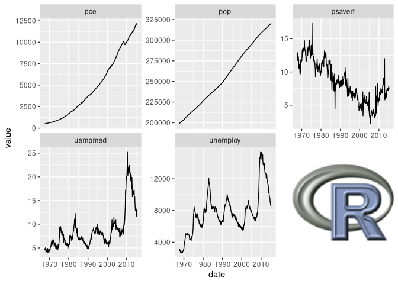
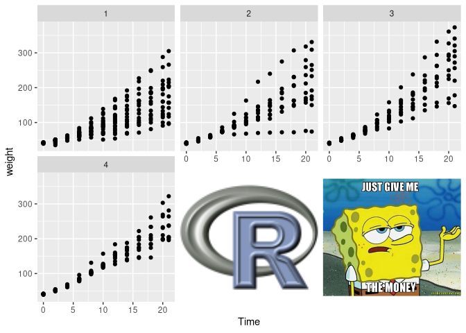
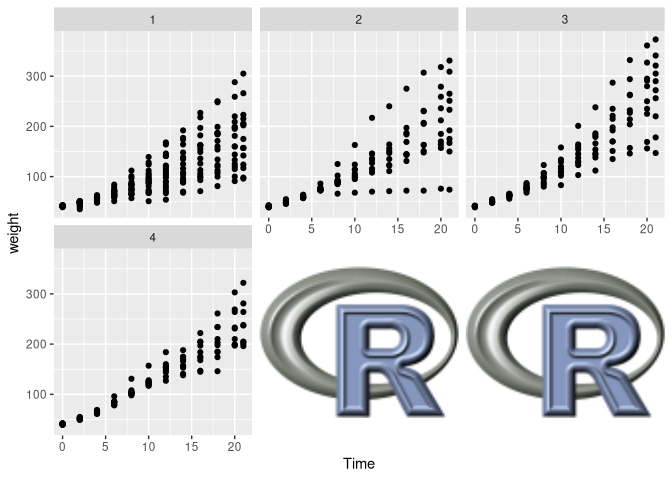

<!-- README.md is generated from README.Rmd. Please edit that file -->

# ggbillboard

<!-- badges: start -->

<!-- badges: end -->

A package to fill vacant ggplot2 facets with images.

## Installation

You can install the development version of ggbillboard from
[GitHub](https://github.com/nacnudus/ggbillboard) with:

``` r
# install.packages("remotes")
remotes::install_github("nacnudus/ggbillboard")
```

## Example

This is a basic example which shows you how to solve a common problem:

``` r
library(ggbillboard)

library(ggplot2)

library(png) # To load png image files
library(jpeg) # To load jpeg image files

img1 <- readPNG(system.file("img", "Rlogo.png", package="ggbillboard"))
img2 <- readJPEG(system.file("img", "spongebob.png", package="ggbillboard"))

# Images must be converted to grobs.
g1 <- grid::rasterGrob(img1, interpolate=TRUE)
g2 <- grid::rasterGrob(img2, interpolate=TRUE)

# Create a plot
p1 <-
  ggplot(economics_long, aes(date, value)) +
  geom_line() +
  facet_wrap(vars(variable), scales = "free_y", nrow = 2)

# Fill the vacant facet with an image
billboard(p1, g1)
```



``` r

# If multiple facets are vacant, you can use more than one image, and they will
# be recycled to fill all vacant facets.
p2 <-
  ggplot(ChickWeight, aes(Time, weight)) +
  geom_point() +
  facet_wrap(~ Diet, ncol = 3)

billboard(p2, list(g1, g2))
```



``` r
billboard(p2, g1)
```


